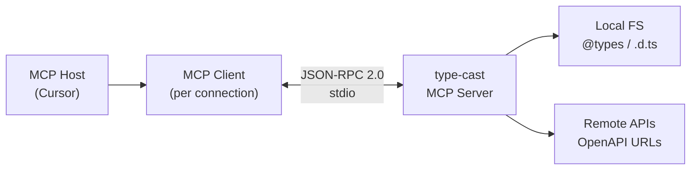
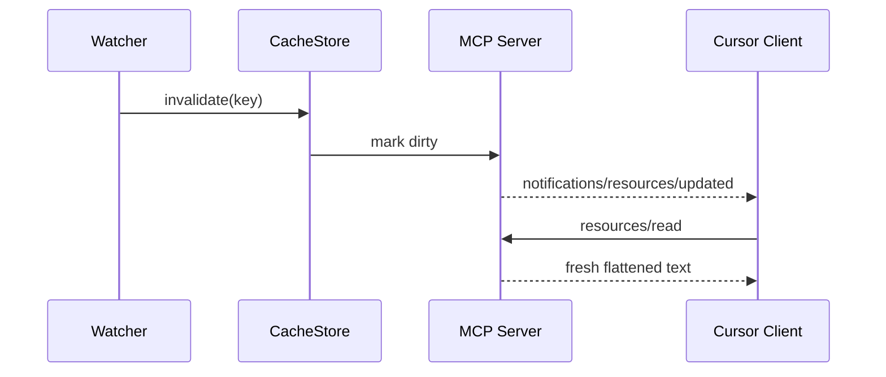

# type-cast — Master Technical Architecture (BLUEPRINT)

> **Status:** Phase 0 — scaffold only (no operational parsers or MCP handlers yet)  
> **Spec baseline:** [MCP Specification 2025-11-25](https://modelcontextprotocol.io/specification/2025-11-25)  
> **SDK baseline:** `@modelcontextprotocol/sdk` **v1.x** (production-stable; v2 migration path documented in §12)

---

## 1. Vision & Problem Statement

### 1.1 The Problem

| Pain point | Why it matters |
|------------|----------------|
| Third-party APIs change | LLMs cite stale endpoints, wrong paths, deprecated fields |
| `@types/*` and local `.d.ts` evolve | Models hallucinate interfaces or merge incompatible versions |
| Training cutoffs | No grounded view of *your* project's actual typings and OpenAPI contracts |

### 1.2 The Solution — **type-cast**

A **hot-reloading MCP server** that:

1. **Ingests** sources on demand — `node_modules/@types`, project `.d.ts`, remote OpenAPI (YAML/JSON).
2. **Flattens** them into plain-text, token-efficient summaries optimized for LLM context windows.
3. **Exposes** results via MCP **tools** (pull + transform) and **resources** (pull-based `flatten://` URIs with optional subscriptions).
4. **Watches** filesystem and schema sources so Cursor (and other MCP hosts) receive `list_changed` / `updated` notifications when reality changes.

### 1.3 Non-Goals (v1)

- Not a language server (no go-to-definition, refactor, or type-checker replacement).
- Not a hosted SaaS in Phase 0–2 (stdio-first for Cursor local integration).
- Not an LLM proxy (no sampling/elicitation in early phases unless explicitly added later).

---

## 2. MCP Protocol Alignment (Official Model)

This design follows the [architecture overview](https://modelcontextprotocol.io/docs/learn/architecture) and the **2025-11-25** server primitives.

### 2.1 Participants



- **Host:** Cursor (or Claude Desktop, VS Code, etc.).
- **Client:** One stdio session per spawned server process.
- **Server:** This repository — exposes tools + resources only (no prompts in Phase 1 unless needed).

### 2.2 Transport Choice — **stdio** (Phase 0–2)

| Transport | Use in type-cast | Rationale |
|-----------|------------------|-----------|
| **stdio** | **Primary** | Cursor spawns the server as a child process; zero network config; lowest latency locally |
| Streamable HTTP | Phase 3+ optional | Remote/shared deployments, OAuth, multi-client |

**Critical rule:** On stdio, **stdout is exclusively JSON-RPC**. All logging and diagnostics **must** use **stderr** (enforced in `src/index.ts`).

### 2.3 Capabilities Negotiated at Initialize

```json
{
  "capabilities": {
    "tools": { "listChanged": true },
    "resources": {
      "subscribe": true,
      "listChanged": true
    }
  }
}
```

| Capability | Spec reference | type-cast usage |
|------------|----------------|-----------------|
| `tools.listChanged` | [Tools](https://modelcontextprotocol.io/specification/2025-11-25/server/tools) | Re-register tools when parser plugins change (rare) |
| `resources.subscribe` | [Resources](https://modelcontextprotocol.io/specification/2025-11-25/server/resources) | Push `notifications/resources/updated` when watched files/schemas change |
| `resources.listChanged` |同上 | Emit `notifications/resources/list_changed` when flatten cache keys change |

### 2.4 Tools vs Resources — Division of Responsibility

| Primitive | MCP role | type-cast responsibility |
|-----------|----------|---------------------------|
| **Tool** | Model-invoked **actions** with side effects | **Fetch / parse / refresh** — network + CPU work |
| **Resource** | Application-driven **read-only context** | **Serve flattened text** — what Cursor attaches to context |

**Design principle:** Tools *produce* and *invalidate* cache entries; Resources *read* stable `flatten://` URIs. This matches MCP guidance: resources are for context; tools are for operations ([resources spec](https://modelcontextprotocol.io/specification/2025-11-25/server/resources), [tools spec](https://modelcontextprotocol.io/specification/2025-11-25/server/tools)).

---

## 3. SDK Strategy — `@modelcontextprotocol/sdk` v1

### 3.1 Why v1 (Unified Package) Now

The user requirement targets the **unified v1 SDK**:

```ts
import { Server } from "@modelcontextprotocol/sdk/server/index.js";
import { StdioServerTransport } from "@modelcontextprotocol/sdk/server/stdio.js";
```

Official guidance (as of 2026):

- **v1.x** (`@modelcontextprotocol/sdk`) — recommended for production; full examples and Cursor ecosystem compatibility.
- **v2.x** (split into `@modelcontextprotocol/server`, `@modelcontextprotocol/core`, …) — pre-stable; migration guide: [typescript-sdk/docs/migration.md](https://github.com/modelcontextprotocol/typescript-sdk/blob/main/docs/migration.md).

### 3.2 `Server` vs `McpServer` — Layered Approach

| Class | Layer | When we use it |
|-------|-------|----------------|
| **`Server`** | Low-level JSON-RPC handler (`setRequestHandler`) | **Phase 0 bootstrap** (current `src/index.ts`); full control over schemas and errors |
| **`McpServer`** | High-level (`registerTool`, `registerResource`, `ResourceTemplate`) | **Phase 2+** optional refactor for ergonomics — not required if `Server` handlers stay thin |

Phase 0 intentionally uses **`Server`** so capability wiring and error semantics are visible before adding domain logic.

### 3.3 Required Peer Dependencies

- **`zod`** `^3.25 || ^4` — SDK peer; tool `inputSchema` validation in Phase 2.
- Deep imports **must** include `.js` extensions (`NodeNext` resolution).

---

## 4. Functional Specification

### 4.1 Tool: `fetch_openapi_schema`

**Purpose:** Download and parse an external OpenAPI 3.x document (JSON or YAML).

| Field | Value |
|-------|-------|
| **MCP name** | `fetch_openapi_schema` |
| **Input** | `{ "url": string }` — HTTPS URL (optional `headers` map in Phase 2) |
| **Output** | `CallToolResult` with `content[]` text summary + optional `structuredContent` |
| **Side effects** | Writes/updates cache entry; may register new `flatten://openapi/...` resource |
| **Errors** | Tool execution errors (`isError: true`) for 4xx/5xx, parse failures — per [tools error handling](https://modelcontextprotocol.io/specification/2025-11-25/server/tools#error-handling) |

**Pipeline (future):**

```
url → fetch (native fetch) → detect content-type → parse (yaml/json)
  → @redocly/openapi-core or openapi-types (TBD in Phase 2)
  → FlattenFormatter → CacheStore → resource URI
```

### 4.2 Tool: `parse_local_types`

**Purpose:** Inspect `node_modules/@types/<package>` and/or project `.d.ts` files.

| Field | Value |
|-------|-------|
| **MCP name** | `parse_local_types` |
| **Input** | `{ "packageName": string, "paths"?: string[] }` |
| **Resolution order** | 1. `@types/<packageName>` 2. package `"types"` field 3. explicit `paths` |
| **Output** | Flattened interface/type alias listing (plain text) |
| **Side effects** | Cache + `flatten://types/...` resource registration |

**Pipeline (future):**

```
packageName → resolve via createRequire / tsconfig paths
  → TypeScript compiler API (createProgram / getTypeChecker) OR ts-morph
  → strip internals / collapse unions → FlattenFormatter → CacheStore
```

### 4.3 Resource URI Scheme — `flatten://`

Custom scheme per [RFC 3986 + MCP custom schemes](https://modelcontextprotocol.io/specification/2025-11-25/server/resources#custom-uri-schemes).

#### 4.3.1 URI Grammar

```
flatten://<kind>/<id>[?<query>]
```

| Component | Description |
|-----------|-------------|
| `kind` | `types` \| `openapi` \| `merged` |
| `id` | Stable slug (e.g. `axios`, `petstore-v3`, `workspace-src`) |
| `query` | Optional: `?rev=<cacheRevision>` for debugging |

**Examples:**

| URI | Content |
|-----|---------|
| `flatten://types/axios` | Flattened `@types/axios` |
| `flatten://openapi/stripe-2024-11-20` | Flattened Stripe OpenAPI |
| `flatten://merged/my-app-deps` | Combined types + OpenAPI for one workspace profile |

#### 4.3.2 Resource Templates (MCP `resources/templates/list`)

Expose parameterized templates for discovery:

```json
{
  "uriTemplate": "flatten://types/{packageName}",
  "name": "Flattened DefinitelyTyped package",
  "mimeType": "text/plain"
}
```

```json
{
  "uriTemplate": "flatten://openapi/{schemaId}",
  "name": "Flattened OpenAPI schema",
  "mimeType": "text/plain"
}
```

#### 4.3.3 Read Semantics (`resources/read`)

- **Hit:** Return `text/plain` body from `CacheStore`.
- **Miss:** Return JSON-RPC error `-32002` Resource not found (or optionally lazy-invoke parser — **decision: miss only in v1**; hosts must call tools first).
- **Subscribe:** `chokidar` watches backing files; on change → re-flatten → `notifications/resources/updated`.

---

## 5. Hot-Reload Architecture

### 5.1 Two Reload Dimensions

| Dimension | Mechanism | Trigger |
|-----------|-----------|---------|
| **Server dev reload** | `tsx watch src/index.ts` (`npm run dev`) | Developer edits server code |
| **Context hot reload** | File watchers + MCP notifications | `@types`, `.d.ts`, cached OpenAPI files change |

### 5.2 Context Refresh Flow



### 5.3 Debouncing & Coalescing

- **Debounce:** 300ms default for filesystem bursts (save all, npm install).
- **Coalesce:** Multiple files → single notification per resource URI.
- **Max concurrency:** 1 flatten job per `id` (mutex per cache key).

---

## 6. Project Directory Layout

```
type-cast/
├── BLUEPRINT.md                 # This document
├── package.json                 # ESM, engines >=20, scripts
├── tsconfig.json                # strict + NodeNext
├── .gitignore
│
├── src/
│   ├── index.ts                 # ✅ Phase 0 — transport bootstrap + safe logging
│   │
│   ├── mcp/                     # Phase 1 — protocol wiring
│   │   ├── server.ts            # Server factory, capability constants
│   │   ├── handlers/
│   │   │   ├── tools.ts         # ListTools / CallTool dispatch
│   │   │   └── resources.ts     # ListResources / Read / Subscribe
│   │   └── schemas.ts           # Zod input schemas → JSON Schema
│   │
│   ├── tools/                   # Phase 2 — tool implementations
│   │   ├── fetch-openapi-schema.ts
│   │   └── parse-local-types.ts
│   │
│   ├── resources/               # Phase 2 — flatten:// provider
│   │   ├── flatten-uri.ts       # Parse / validate flatten:// URIs
│   │   ├── template-registry.ts
│   │   └── read-resource.ts
│   │
│   ├── parsers/                 # Phase 2–3 — domain logic
│   │   ├── openapi/
│   │   │   ├── fetcher.ts
│   │   │   └── flatten.ts
│   │   └── typescript/
│   │       ├── resolver.ts      # @types / paths resolution
│   │       └── flatten.ts
│   │
│   ├── cache/                   # Phase 2
│   │   ├── store.ts             # In-memory + optional disk snapshot
│   │   └── types.ts
│   │
│   ├── watch/                   # Phase 3
│   │   └── file-watcher.ts      # chokidar integration
│   │
│   └── lib/
│       ├── logger.ts            # Structured stderr logger (extract from index)
│       └── errors.ts            # McpError helpers, isError results
│
├── dist/                        # tsc output (gitignored)
│
└── .cursor/
    └── mcp.json                 # Phase 1 — Cursor host configuration (example in §10)
```

---

## 7. Dependency Choices

### 7.1 Runtime (Phase 0 — installed)

| Package | Version | Role |
|---------|---------|------|
| `@modelcontextprotocol/sdk` | `^1.29.0` | MCP `Server`, `StdioServerTransport`, protocol types |
| `zod` | `^3.25.0` | Tool input validation (SDK peer) |

### 7.2 Runtime (Phase 2+ — planned)

| Package | Role | Notes |
|---------|------|-------|
| `chokidar` | Filesystem watch | Resource subscriptions |
| `yaml` | OpenAPI YAML parse | Prefer small, well-maintained parser |
| Native `fetch` | HTTP download | Node 20+ built-in; no axios unless retry middleware needed |
| `typescript` | `.d.ts` AST | `createProgram` for accurate flattening |
| `openapi-types` + custom walker | OpenAPI flatten | Evaluate `@redocly/openapi-core` if validation required |

### 7.3 DevDependencies

| Package | Role |
|---------|------|
| `typescript` | Build |
| `tsx` | `npm run dev` watch mode |
| `@types/node` | Node 20 typings |

---

## 8. TypeScript / ESM Configuration

| Setting | Value | Why |
|---------|-------|-----|
| `"type": "module"` | `package.json` | Native ESM aligned with SDK examples |
| `module` / `moduleResolution` | `NodeNext` | Correct `.js` import paths in emitted output |
| `strict` | `true` | Prevent undefined access in URI parsing |
| `verbatimModuleSyntax` | `true` | Explicit type-only imports |
| `noUncheckedIndexedAccess` | `true` | Safe cache map access |

**Import convention:**

```ts
import { Server } from "@modelcontextprotocol/sdk/server/index.js";
// Always use .js extension in source — maps to .ts at compile time
```

---

## 9. Security & Operational Constraints

Per MCP [tools](https://modelcontextprotocol.io/specification/2025-11-25/server/tools#security-considerations) and [resources](https://modelcontextprotocol.io/specification/2025-11-25/server/resources#security-considerations) security sections:

| Risk | Mitigation |
|------|------------|
| SSRF via `fetch_openapi_schema` | Allowlist hosts optional; block `file://`, private IP ranges (configurable); max response size |
| Path traversal in `parse_local_types` | Resolve paths under workspace root only; reject `..` segments |
| Sensitive data in resources | Never auto-read `.env`, keys, or `node_modules` outside requested package |
| stdout corruption | stderr-only logging; redirect `console.log` (bootstrap) |
| Rate limiting | Per-tool concurrency caps; fetch timeout (30s default) |

---

## 10. Cursor Integration (Phase 1)

Example `.cursor/mcp.json` (not committed until Phase 1):

```json
{
  "mcpServers": {
    "type-cast": {
      "command": "node",
      "args": ["/absolute/path/to/type-cast/dist/index.js"],
      "env": {
        "TYPE_CAST_WORKSPACE": "/absolute/path/to/your/project"
      }
    }
  }
}
```

Development alternative:

```json
{
  "mcpServers": {
    "type-cast": {
      "command": "npx",
      "args": ["tsx", "/absolute/path/to/type-cast/src/index.ts"]
    }
  }
}
```

---

## 11. Implementation Phases (Checklist)

### Phase 0 — Scaffold ✅ (current)

- [x] `package.json`, `tsconfig.json`, `src/index.ts`
- [x] `Server` + `StdioServerTransport` + safe stderr logging
- [ ] `npm install && npm run build` verification

### Phase 1 — MCP wiring (no parsers)

- [ ] Extract `src/mcp/server.ts`, `handlers/tools.ts`, `handlers/resources.ts`
- [ ] Register tool stubs returning `not implemented` with `isError: true`
- [ ] Register static `flatten://` resource templates (empty catalog)
- [ ] `.cursor/mcp.json` example

### Phase 2 — Core tools & cache

- [ ] `fetch_openapi_schema` + `parse_local_types`
- [ ] `CacheStore` with revision IDs
- [ ] `resources/read` served from cache

### Phase 3 — Hot reload

- [ ] `chokidar` watchers
- [ ] `resources/subscribe` + `notifications/resources/updated`
- [ ] `notifications/resources/list_changed` on new URIs

### Phase 4 — Hardening

- [ ] SSRF / path guards
- [ ] Disk cache snapshots
- [ ] Optional Streamable HTTP transport

---

## 12. v2 SDK Migration Notes (Future)

When `@modelcontextprotocol/server` stabilizes:

| v1 | v2 |
|----|-----|
| `@modelcontextprotocol/sdk/server/index.js` | `@modelcontextprotocol/server` |
| `@modelcontextprotocol/sdk/server/stdio.js` | `@modelcontextprotocol/server/stdio` |
| `Server` / `McpServer` | `McpServer` with `registerTool` |
| Zod v3 or v4 | Zod v4 preferred |

Plan a dedicated migration PR after v2 GA — no blocker for Phase 0–2.

---

## 13. Flattened Output Format (Contract Preview)

Plain-text sections (stable headings for LLM parsing):

```text
# type-cast flatten
source: flatten://types/axios
revision: 7f3a2c
generatedAt: 2026-06-05T12:00:00.000Z

## exports
- interface AxiosRequestConfig { ... }
- type AxiosResponse<T = any> = ...

## endpoints
- GET /users/{id}
  params: id: string
  response: User
```

---

## 14. Open Questions (for review before Phase 1)

1. **Lazy resource read on miss** — Should `resources/read` trigger parsing, or strictly require a prior tool call?
2. **TypeScript API** — `typescript` package (accurate, heavier) vs `ts-morph` (ergonomic, heavier) vs regex (fast, unsafe)?
3. **OpenAPI flatten depth** — Full schema dump vs endpoint-only summary for token budget?
4. **Server vs McpServer** — Refactor to `McpServer` in Phase 1 for `ResourceTemplate`, or stay on `Server` handlers throughout?

---

## 15. References

| Resource | URL |
|----------|-----|
| MCP Specification (2025-11-25) | https://modelcontextprotocol.io/specification/2025-11-25 |
| MCP Architecture | https://modelcontextprotocol.io/docs/learn/architecture |
| MCP Tools | https://modelcontextprotocol.io/specification/2025-11-25/server/tools |
| MCP Resources | https://modelcontextprotocol.io/specification/2025-11-25/server/resources |
| TypeScript SDK (v1 API) | https://ts.sdk.modelcontextprotocol.io/ |
| TypeScript SDK repo (v1.x branch) | https://github.com/modelcontextprotocol/typescript-sdk/tree/v1.x |
| SDK v2 migration | https://github.com/modelcontextprotocol/typescript-sdk/blob/main/docs/migration.md |

---

*End of BLUEPRINT — verify directory layout and phase plan before implementing Phase 1 handlers.*
