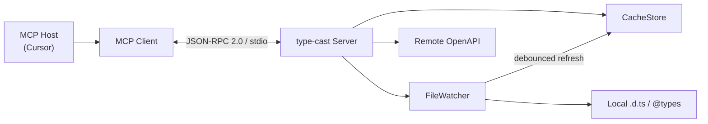

# type-cast

**Ground your AI in real TypeScript types and OpenAPI contracts — not hallucinated interfaces.**

type-cast is a hot-reloading [Model Context Protocol (MCP)](https://modelcontextprotocol.io) server that dynamically parses local `@types` packages, project `.d.ts` files, and remote OpenAPI schemas, flattening them into plain-text context optimized for LLM consumption.

Built for [Cursor](https://cursor.com) and any MCP-compatible host. Runs locally over **stdio** with zero network configuration.

---

## Table of Contents

- [Why type-cast?](#why-type-cast)
- [Features](#features)
- [How It Works](#how-it-works)
- [Architecture](#architecture)
- [Requirements](#requirements)
- [Installation](#installation)
- [Cursor Integration](#cursor-integration)
- [MCP Tools](#mcp-tools)
- [MCP Resources](#mcp-resources)
- [Environment Variables](#environment-variables)
- [Flattened Output Format](#flattened-output-format)
- [Development](#development)
- [Testing](#testing)
- [Security](#security)
- [Project Structure](#project-structure)
- [Documentation](#documentation)
- [License](#license)

---

## Why type-cast?

| Problem | What goes wrong | How type-cast helps |
|---------|-----------------|---------------------|
| APIs change constantly | Models cite stale endpoints and wrong request shapes | Fetches and flattens live OpenAPI documents on demand |
| `@types/*` evolve | Models invent interfaces or merge incompatible versions | Parses installed DefinitelyTyped and local `.d.ts` files from *your* workspace |
| Training cutoffs | No view of your project's actual contracts | Exposes grounded, token-efficient summaries via MCP resources |

type-cast does **not** replace a language server. It is a **context provider** — tools fetch and transform; resources serve read-only flattened text to the host.

---

## Features

- **Two MCP tools** — `fetch_openapi_schema` and `parse_local_types` for on-demand ingestion
- **Custom `flatten://` URI scheme** — pull-based resources for TypeScript packages and OpenAPI schemas
- **In-memory cache** — revision-tracked entries with `list_changed` / `updated` notifications
- **Hot reload** — `chokidar` file watchers with 300ms debounce; auto-refresh when `.d.ts` files change
- **Resource subscriptions** — `resources/subscribe` support for live context updates in Cursor
- **Security hardening** — path traversal rejection, SSRF loopback blocking, fetch timeouts and size limits
- **Verification harness** — isolated test script for security gates and parse pipeline validation

---

## How It Works

```
┌─────────────┐     tools/call      ┌──────────────┐     parse / fetch     ┌─────────────┐
│   Cursor    │ ──────────────────► │  type-cast   │ ────────────────────► │   Sources   │
│  MCP Host   │                     │  MCP Server  │                       │ @types /    │
│             │ ◄────────────────── │              │ ◄──────────────────── │ OpenAPI URL │
└─────────────┘  resources/read     └──────────────┘     CacheStore        └─────────────┘
                   flatten://...
```

1. The LLM (via Cursor) calls a **tool** to fetch or parse a source.
2. type-cast flattens the result into a plain-text document and stores it in `CacheStore`.
3. Cursor attaches the cached payload via a **`flatten://` resource URI**.
4. When watched files change, the server debounces events, re-flattens, and pushes **`notifications/resources/updated`** to the host.

---

## Architecture



| Layer | Responsibility |
|-------|----------------|
| **MCP handlers** | Tool listing/calling, resource templates, read, subscribe |
| **Tools** | Orchestrate parse/fetch → cache → registry |
| **Parsers** | TypeScript AST flattening, OpenAPI endpoint summarization |
| **Cache** | Singleton store with revision IDs and update listeners |
| **Watch** | `chokidar` with 300ms coalescing; per-URI refresh mutex |

**Transport:** stdio only (stdout = JSON-RPC; stderr = all logging).

**Protocol:** [MCP Specification 2025-11-25](https://modelcontextprotocol.io/specification/2025-11-25)  
**SDK:** [`@modelcontextprotocol/sdk`](https://www.npmjs.com/package/@modelcontextprotocol/sdk) v1.x

---

## Requirements

- **Node.js** ≥ 20
- **npm** (or compatible package manager)
- An MCP-compatible host (Cursor recommended)

---

## Installation

```bash
git clone <repository-url> type-cast
cd type-cast
npm install
npm run build
```

Verify the build output:

```bash
ls dist/index.js
```

Run the server directly (typically Cursor spawns it automatically):

```bash
npm start
```

---

## Cursor Integration

### 1. Build the server

```bash
npm run build
```

### 2. Add MCP configuration

Create `.cursor/mcp.json` in the project you want type-cast to analyze:

```json
{
  "mcpServers": {
    "type-cast": {
      "command": "node",
      "args": ["/absolute/path/to/type-cast/dist/index.js"],
      "env": {
        "TYPE_CAST_WORKSPACE": "/absolute/path/to/your/application"
      }
    }
  }
}
```

| Field | Description |
|-------|-------------|
| `command` | Node.js runtime |
| `args` | Absolute path to compiled `dist/index.js` |
| `TYPE_CAST_WORKSPACE` | Root directory for `@types` resolution, explicit `.d.ts` paths, and file watchers |

### 3. Restart MCP

Reload MCP servers in Cursor Settings → MCP, then confirm **type-cast** appears with both tools.

### Development mode (no rebuild)

```json
{
  "mcpServers": {
    "type-cast": {
      "command": "npx",
      "args": ["tsx", "/absolute/path/to/type-cast/src/index.ts"],
      "env": {
        "TYPE_CAST_WORKSPACE": "/absolute/path/to/your/application"
      }
    }
  }
}
```

See [CURSOR_MCP.md](./CURSOR_MCP.md) for the full integration guide.

---

## MCP Tools

### `fetch_openapi_schema`

Downloads and parses an external OpenAPI 3.x document (JSON or YAML).

| Parameter | Type | Required | Description |
|-----------|------|----------|-------------|
| `url` | `string` (URI) | Yes | HTTPS URL of an OpenAPI document |

**Side effects:** Caches flattened output at `flatten://openapi/{schemaId}` (schema ID derived from URL hash).

**Example use case:** Ground the model in a live Stripe, GitHub, or internal API spec instead of memorized endpoints.

---

### `parse_local_types`

Inspects and flattens TypeScript declarations from the workspace.

| Parameter | Type | Required | Description |
|-----------|------|----------|-------------|
| `packageName` | `string` | Yes | npm package name (e.g. `axios` → `@types/axios`) |
| `paths` | `string[]` | No | Explicit `.d.ts` paths relative to workspace root |

**Resolution order:**

1. `node_modules/@types/<packageName>`
2. Installed package `"types"` / `"typings"` field
3. Explicit `paths` (if provided)

**Side effects:** Caches flattened output at `flatten://types/{packageName}` and registers file watchers for hot reload.

---

## MCP Resources

type-cast exposes parameterized resource templates via `resources/templates/list`:

| URI Template | Description |
|--------------|-------------|
| `flatten://types/{packageName}` | Flattened exported types, interfaces, and namespaces |
| `flatten://openapi/{schemaId}` | Compressed endpoint summary for an ingested OpenAPI spec |

### Reading resources

```
resources/read → { "uri": "flatten://types/axios" }
```

- **Cache hit** → returns `text/plain` flattened content
- **Cache miss** → JSON-RPC error `-32002` (call the corresponding tool first)

### Subscriptions

Clients may call `resources/subscribe` to receive `notifications/resources/updated` when watched declaration files change.

---

## Environment Variables

| Variable | Default | Description |
|----------|---------|-------------|
| `TYPE_CAST_WORKSPACE` | `process.cwd()` | Workspace root for type resolution, path validation, and file watching |

---

## Flattened Output Format

All cached payloads follow a stable plain-text contract for LLM parsing:

```text
# type-cast flatten
source: flatten://types/axios
package: axios
resolvedFrom: @types/axios
revision: 7f3a2c1b
generatedAt: 2026-06-10T12:00:00.000Z

## exports
- interface AxiosRequestConfig: interface AxiosRequestConfig { ... }
- type AxiosResponse<T>: type AxiosResponse<T = any> = ...
```

OpenAPI payloads use an `## endpoints` section with method, path, parameters, and response summaries.

---

## Development

```bash
# Install dependencies
npm install

# Type-check without emitting
npm run typecheck

# Watch mode (server dev reload)
npm run dev

# Production build
npm run build

# Clean build artifacts
npm run clean
```

### Scripts

| Script | Description |
|--------|-------------|
| `npm run build` | Compile TypeScript to `dist/` |
| `npm start` | Run compiled server |
| `npm run dev` | `tsx watch` for development |
| `npm run typecheck` | Type-check only |
| `npm run test:harness` | Run Phase 4 verification suite |
| `npm run clean` | Remove `dist/` |

---

## Testing

Run the isolated verification harness (no stdio MCP transport):

```bash
npm run test:harness
```

The harness validates:

| Test | What it checks |
|------|----------------|
| **Traversal** | `../../../etc/passwd` paths are rejected before filesystem access |
| **SSRF** | Loopback URLs (`127.0.0.1`) are blocked before `fetch` |
| **Live parse** | Mock `.d.ts` → `flatten://types/` entry in `CacheStore` with extracted exports |

Expected output ends with:

```text
── Summary ──
total: 6  passed: 6  failed: 0

All security gates and parse pipeline checks passed.
```

---

## Security

type-cast implements defense-in-depth for local MCP operation:

| Threat | Mitigation |
|--------|------------|
| **Path traversal** | Rejects `..` segments; resolves paths strictly under `TYPE_CAST_WORKSPACE` |
| **SSRF** | HTTP(S) only; blocks localhost, loopback, and private IP ranges |
| **Response bombs** | 5 MB max response size; 30 s fetch timeout |
| **stdout corruption** | All diagnostics on stderr; accidental `console.log` redirected |

Run `npm run test:harness` before deploying to a new environment.

---

## Project Structure

```
type-cast/
├── src/
│   ├── index.ts                 # Server bootstrap, watcher lifecycle, signal handling
│   ├── test-harness.ts          # Phase 4 verification script
│   ├── cache/
│   │   ├── store.ts             # Singleton CacheStore + update events
│   │   ├── registry.ts          # URI → source file / URL tracking
│   │   └── types.ts             # CacheEntry interfaces
│   ├── lib/
│   │   └── paths.ts             # Traversal-safe path resolution
│   ├── mcp/
│   │   ├── handlers/
│   │   │   ├── tools.ts         # tools/list, tools/call
│   │   │   └── resources.ts     # templates, read, subscribe
│   │   └── resource-notifications.ts
│   ├── parsers/
│   │   ├── openapi/             # Fetch + flatten OpenAPI
│   │   └── typescript/          # Resolve + flatten .d.ts
│   ├── resources/
│   │   ├── flatten-uri.ts       # flatten:// URI grammar
│   │   └── read-resource.ts     # Cache-backed reads
│   ├── tools/
│   │   ├── fetch-openapi-schema.ts
│   │   └── parse-local-types.ts
│   └── watch/
│       ├── file-watcher.ts      # chokidar + 300ms debounce
│       └── refresh-resource.ts  # Re-parse on file change
├── dist/                        # Compiled output (gitignored)
├── BLUEPRINT.md                 # Master technical architecture
├── CURSOR_MCP.md                # Cursor setup guide
└── package.json
```

---

## Documentation

| Document | Description |
|----------|-------------|
| [BLUEPRINT.md](./BLUEPRINT.md) | Full technical architecture, phased implementation plan, MCP spec alignment |
| [CURSOR_MCP.md](./CURSOR_MCP.md) | Step-by-step Cursor MCP configuration |

### External references

- [Model Context Protocol](https://modelcontextprotocol.io)
- [MCP Specification (2025-11-25)](https://modelcontextprotocol.io/specification/2025-11-25)
- [MCP TypeScript SDK (v1)](https://ts.sdk.modelcontextprotocol.io/)

---

## What type-cast is not

- A Language Server Protocol (LSP) replacement
- A type checker or refactoring engine
- A hosted cloud service (stdio-first, local by design)
- An LLM proxy or sampling provider

---

## License

Licensed under the **MIT License** (see `package.json`).

---

<p align="center">
  <sub>Built with the Model Context Protocol · TypeScript · Node.js</sub>
</p>
